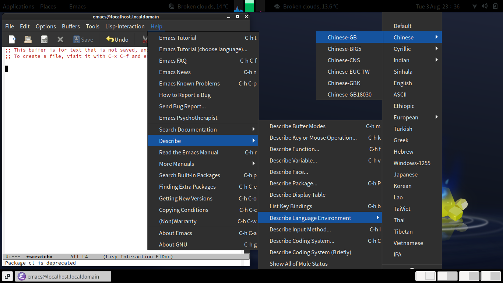

# Internalization in GNU emacs

The figure below illustrates 3 useful tricks.

- After setting Language Environment to "Chinese-GB", the effect for some
of the other commands changes. In particular, the default of
`M-x set-input-method` changes from nothing (no default), to `chinese-py-punct`.
- `M-x describ-char` goes into split-screen, and showing information about the
current character at the cursor position, how to input it in the current input
method, what font is being used to display it, etc.
- It is possible to tell emacs, after a file opened and the content looking wrong,
to tell it to "Revisit this file immediately using specified coding system".


General tips:

- `C-x \` to toggle current input method and ascii.
- You select the one you mean using keys such as `C-f` (forward), `C-b` (backward), `C-n` (next line), `C-p` (previous line) (or the
arrow keys), and digits,  `C-SPC` for current position . `C-x 8 RET` (`M-x insert-char`) prompts raw code points in hex.
- `C-x 1` to go back to single screen.
- `C-x o` to switch to other screen.

There are three ways of telling emacs that the current file is in, for example, GB2312 encoding:

- `LANG=zh_CN.GB2312 emacs ...` at launch
- `-*- coding: gb2312 -*-` as part of the first line of the file, or equivalent at the end of file (see Chapter 33, **Customization**, **Local Variables in files**, **Specifying File Variables**):

```
/* Local Variables: */
/* coding: gb2312   */
/* End:             */
```

- It is possible to set [Emacs Directory Variables](https://www.gnu.org/software/emacs/manual/html_node/emacs/Directory-Variables.html) for whole set of files
in a directory.

- "**Set Language Environment**" and "**Set Coding Systems**" (both), as above.

Cut and Paste with other applications: Emacs is clever enough and treats by default everything from X11
(as `x-select-request-type`) in the order `UTF8_STRING`, `COMPOUND_TEXT`, `STRING`, regardless and independent
of the current file buffer content.

## Various useful things under M-x

- `describe-key` and press a key

- `describe-char` describe the character under the cursor.

- `(global-set-key [kp-5] 'goto-line)` to bind keypad-5 to `goto-line`.

- It is not a good idea to rebind `ESC` (`Meta` and `\C-[`), see [description of meta-prefix-char](https://www.gnu.org/software/emacs/manual/html_node/elisp/Functions-for-Key-Lookup.html) and [Meta-Character Syntax](https://www.gnu.org/software/emacs/manual/html_node/elisp/Meta_002dChar-Syntax.html), or [\C-h](https://www.gnu.org/software/emacs/manual/html_node/elisp/Help-Functions.html), or
[\C-i quirk](https://www.gnu.org/software/emacs/manual/html_node/elisp/Ctl_002dChar-Syntax.html).
[Ordinary text terminals have no way of generating non-ASCII control characters.](https://www.gnu.org/software/emacs/manual/html_node/elisp/Ctl_002dChar-Syntax.html).
[Other Character Modifier Bits](https://www.gnu.org/software/emacs/manual/html_node/elisp/Other-Char-Bits.html), [Basic Char Syntax](https://gnu.org/software/emacs/manual/html_node/elisp/Basic-Char-Syntax.html)

## EDT bugs

- [#50364 27.2; EDT mode Xmodmap related documentation needs updating](https://debbugs.gnu.org/cgi/bugreport.cgi?bug=50364)

- edt-mapper: When numlock is on, keypad keys are alias'ed to `[deletechar]`, '[up]', etc. TPU mapper generates `[kp-delete]`, `[kp-up]`, etc.

# Latest Manuals:

- [GNU emacs 27, pdf](https://www.gnu.org/software/emacs/manual/pdf/emacs.pdf)
- [Emacs quick reference Card, pdf](https://www.gnu.org/software/emacs/refcards/pdf/refcard.pdf)
- [EDT emulation, html](https://www.gnu.org/software/emacs/manual/html_mono/edt.html)

Subset (hosted and copied here): [Emacs Chapter 19, pdf](emacs-27-chapter19.pdf),
[Emacs Lisp reference, Chapter 33, pdf](elisp-27-chapter33.pdf), [EDT emulation, pdf](edt.pdf).
Also [Annnotated sample xmodmap file](xmodmap.txt) for re-mapping the Num_Lock as GOLD key.

Reference: [Intro to emacs Lisp Programming](https://www.gnu.org/software/emacs/manual/pdf/eintr.pdf) and
[Emacs Lisp Reference](https://www.gnu.org/software/emacs/manual/pdf/elisp.pdf)

# Built-in Help:



# Old Versions

Package `emacs25` is available on Ubuntu bionic (18.04LTS).

Older versions are under
[current](http://old-releases.ubuntu.com/ubuntu/pool/universe/e/emacs/),
[emacs21](http://old-releases.ubuntu.com/ubuntu/pool/universe/e/emacs21/),
[emacs22](http://old-releases.ubuntu.com/ubuntu/pool/universe/e/emacs22/),
[emacs23](http://old-releases.ubuntu.com/ubuntu/pool/universe/e/emacs23/),
[emacs24](http://old-releases.ubuntu.com/ubuntu/pool/universe/e/emacs24/),
[emacs25](http://old-releases.ubuntu.com/ubuntu/pool/universe/e/emacs25/).

Some older packaging is missing [dfsg](https://en.wikipedia.org/wiki/Debian_Free_Software_Guidelines)-compliance.
