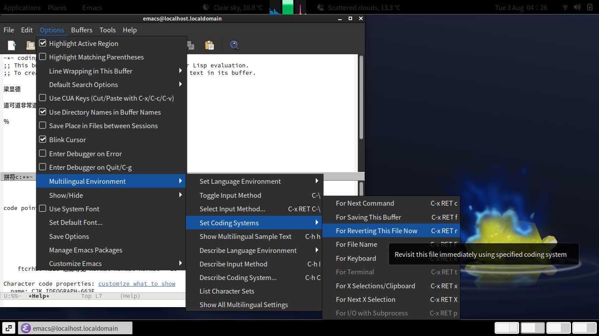

# Internalization in GNU emacs

The figure below illustrates 3 useful tricks.

- After setting Language Environment to "Chinese-GB", the effect for some
of the other commands changes. In particular, the default of
`M-x set-input-method` changes from nothing (no default), to `chinese-py-punct`.
- `M-x describ-char` goes into split-screen, and showing information about the
current character at the cursor position, how to input it in the current input
method, what font is being used to display it, etc.
- It is possible to tell emacs, after a file opened and the content looking wrong,
to tell it to "Revisit this file immediately using specified coding system".



General tips:

- `C-x 1` to go back to single screen.
- `C-x o` to switch to other screen.

There are three ways of telling emacs that the current file is in GB2312 encoding (for example):

- `LANG=zh_CN.GB2312 emacs ...` at launch
- `-*- coding: gb2312 -*-` as part of the first line of the file, or equivalent at the end of file (see Chapter 33, Customization, Local Variables in files, Specifying File Variables):

```
/* Local Variables: */
/* coding: gb2312   */
/* End:             */
```

- "Set Language Environment" and "Set Coding Systems" (both), as above.
