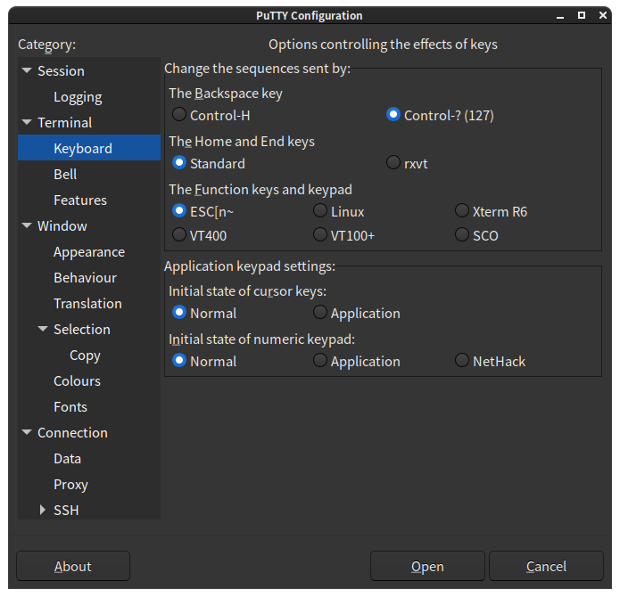

# Keyboard mapping in X11

The simpliest way of disabling the NumLock key, and have it always on, is via
the `numpad:mac` xkb option. There are three ways of doing it:

- via `gsettings` command-line:

```
# Check the original setting:
$ gsettings get org.gnome.desktop.input-sources xkb-options
['lv3:ralt_switch']

# Append 'numpad:mac' to original settings:
$ gsettings set org.gnome.desktop.input-sources xkb-options "['lv3:ralt_switch', 'numpad:mac']"
```

See `/usr/share/X11/xkb/types/numpad` and `/usr/share/X11/xkb/types/extra`.


- via `gnome-tweaks` GUI:


- via `dconf-editor`:


## Using "Num_Lock" as "Clear" as on the mac keyboard (and GOLD on TPU)

We need the Num_Lock key to work differently. `Apple laptop` and `Apple Aluminium` (`Apple Aluminium (ANSI)`, `Apple Aluminium (ISO)`,
`Apple Aluminium (JIS)`) have a "Clear" key which we can emulate.

Edit `/usr/share/X11/xkb/symbols/pc`, line 23:

```
    key <NMLK> {	[ Num_Lock 		]	};
```

To

```
    key <NMLK> {	[ Clear 		]	};
```

Editing `/usr/share/X11/xkb/types/numpad` (where `numpad:mac` lives) with similar changes as `/usr/share/X11/xkb/symbols/macintosh_vndr/apple`
(where the Apple Laptop/Aluminium definitions are) does not work. Alternative to this is to create a new file under `/etc/udev/hwdb.d/` remapping keys.

## Putty's Function Keys and Keypad mapping

From Putty's documentation: "Application Keypad mode is a way for the server to change the behaviour of the numeric keypad." See:

[4.4.3 Changing the action of the function keys and keypad](https://documentation.help/PuTTY/config-funkeys.html),
[4.4.5 Controlling Application Keypad mode](https://documentation.help/PuTTY/config-appkeypad.html),
[4.4.6 Using NetHack keypad mode](https://documentation.help/PuTTY/config-nethack.html),
[4.6.1 Disabling application keypad and cursor keys](https://documentation.help/PuTTY/config-features-application.html#S4.6.1),



[VK_BEGIN on X Windows vs VK_CLEAR on Windows, for num_lock + keypad 5 - JDK-4850137, 2003](https://bugs.java.com/bugdatabase/view_bug.do?bug_id=4850137) . Found it in Putty's Windows terminal code.

On Solaris, the numpad /*- keys produce F24, F25, F26;  but in
Java we map them to /*- anyway.  dtterm acts similar to Java. dtterm also
produces a 5 when the numpad 5 key is pressed, but numlock is off (F31).

# Other tips on Debugging

- `xkbcomp :0.0` writes the keymap into `server-0_0.xkb`.

- `setxkbmap -print` shows the active keymap.

- `setxkbmap -option numpad:mac -print` sets the option on the client.

- `setxkbmap -print | xkbcomp - $DISPLAY` sync's the client with the server.

- `localectl list-x11-keymap-options` lists available options. `list-locales`, `list-keymaps`, `list-x11-keymap-models`, `list-x11-keymap-layouts`,
`list-x11-keymap-variants`, `list-x11-keymap-options` are other useful options.

- Check `/etc/default/keyboard` (This is Ubuntu specific).

- Check `gsettings get org.gnome.settings-daemon.peripherals.keyboard numlock-state`

- Last resort: `gsettings set org.gnome.settings-daemon.peripherals.input-devices hotplug-command "/home/<myname>/key_settings.sh"`

- Check `Preference >accessibility > Mouse: "Control the Pointer using keypad"` and/or `Settings > universal Access > pointing and clicking: "Mouse keys"`.
Turn it off!

- The LED is completely independent - `xset led named "Scroll Lock"` and similarly for `"Num Lock"` and  `"Caps Lock"` to turn them on (or of with `-led`).

## Xmodmap

Xmodmap suppport was removed as early as 2010 Oct in
[Bug 150542 - Keyboard lost in VNC session after launching keyboard capplet](https://bugzilla.gnome.org/show_bug.cgi?id=150542),
[keyboard: Remove horrible xmodmap fallback code](https://gitlab.gnome.org/GNOME/gnome-settings-daemon/-/commit/4239cb8a5d73af79d2cdf0f294a33d31fbbb9afe).

In gnome 3.6 onwards,
[Bug 873656 - .Xmodmap file not loaded by Gnome 3.x](https://bugzilla.redhat.com/show_bug.cgi?id=873656),
[Bug 688906 - Keybard Layout Options override xmodmap]https://bugzilla.gnome.org/show_bug.cgi?id=688906),
[Bug 674874 - don't read .xmodmap files by default](https://bugzilla.gnome.org/show_bug.cgi?id=674874),
[Bug 674221 - g-s-d's hotplug-command called only for mouse]((https://bugzilla.gnome.org/show_bug.cgi?id=674221),
the settings are forgotten after every suspend/resume; it become invalid when you switch to next ibus input method.
Relevant: [keyboard: Run a custom command for new keyboards](https://gitlab.gnome.org/GNOME/gnome-settings-daemon/-/commit/a90f42b0cd0d235f72f24ef4a59ff422351ecdda),
[common: Add hint on how to set the script path](https://gitlab.gnome.org/GNOME/gnome-settings-daemon/-/blob/a90f42b0cd0d235f72f24ef4a59ff422351ecdda/plugins/common/input-device-example.sh), [Bug 674251 - Documentation not clear when g-s-d doesn't apply settings after hotplug-command](https://bugzilla.gnome.org/show_bug.cgi?id=674251), [Bug 635486 - Allow custom command to run on input device hotplug/removal](https://bugzilla.gnome.org/show_bug.cgi?id=635486),
[Bug 348198 - xkb keymap reset when external keyboard plugged in](https://bugs.kde.org/show_bug.cgi?id=348198)

## Wayland

[[3.34] Weird numlock behaviour](https://gitlab.gnome.org/GNOME/mutter/-/issues/769), [g-s/master doesn't maintain a consistent numlock state over applications and g-s overview](https://gitlab.gnome.org/GNOME/mutter/-/issues/714)

#

systemd config - /etc/vconsole.conf

/etc/X11/xorg.conf.d/00-keyboard.conf

/usr/share/X11/xkb/rules/base.lst , /usr/share/X11/xkb/

keymaps(5), loadkeys(1), dumpkeys(1), showkey(1), xmodmap(1), xkeyboard-config(7)
/usr/lib/kbd/keymaps/

[Gentoo keyboard layout switching](https://wiki.gentoo.org/wiki/Keyboard_layout_switching),
[Dated Ubuntu instructions on Apple Keyboard](https://help.ubuntu.com/community/AppleKeyboard)

[Freedesktop Shared default keyboard shortcuts](https://www.freedesktop.org/wiki/Specifications/default-keys-spec/),
[Gnome HIG Standard Keyboard Shortcuts](https://developer.gnome.org/hig/reference/keyboard.html),
[GNOME keyboard shortcuts](https://www.redhat.com/sysadmin/gnome-keyboard-shortcuts),
[GNOME 3 Cheat Sheet](https://wiki.gnome.org/Gnome3CheatSheet),
[Cheat sheet: GNOME 3](https://opensource.com/downloads/cheat-sheet-gnome-3)