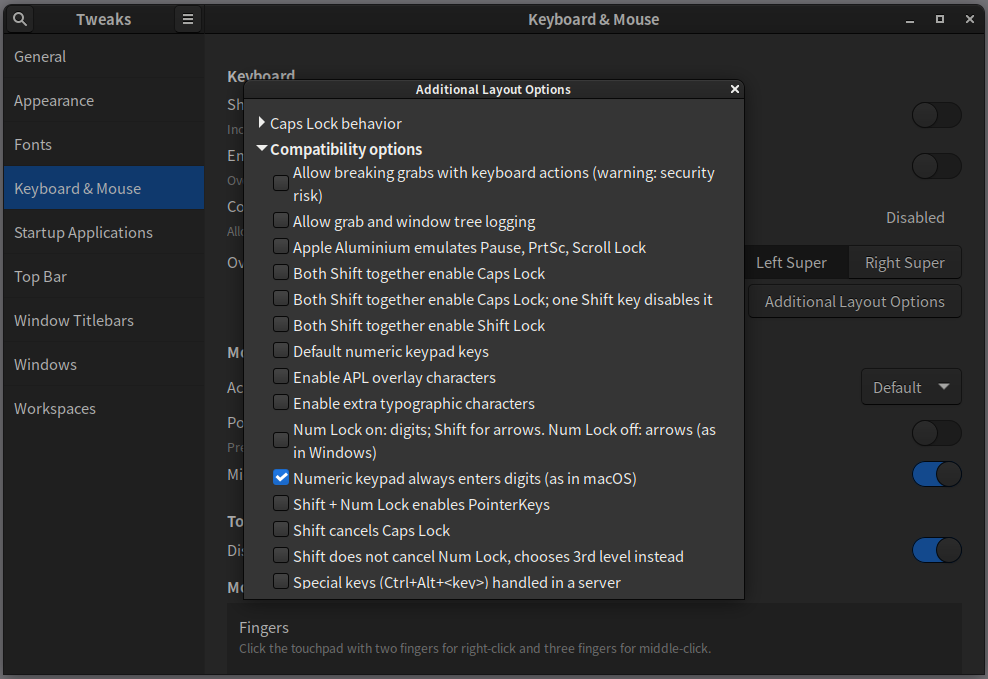
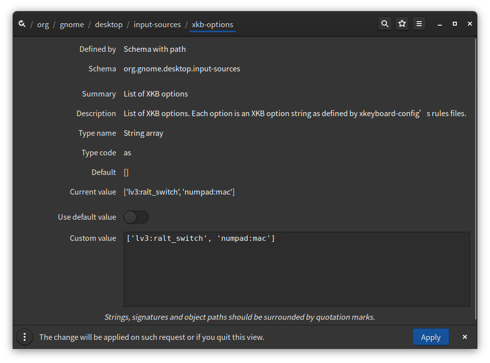

# Keyboard mapping in X11

The simpliest way of disabling the NumLock key, and have it always on, is via
the `numpad:mac` xkb option:

```
$ gsettings get org.gnome.desktop.input-sources xkb-options
['lv3:ralt_switch']
[Hin-Tak@localhost cxterm.wiki]$ gsettings set org.gnome.desktop.input-sources xkb-options "['lv3:ralt_switch', 'numpad:mac']"
```

See `/usr/share/X11/xkb/types/numpad` and `/usr/share/X11/xkb/types/extra`.

Via `gnome-tweaks`:



via `dconf-editor`:



- `xkbcomp :0.0` writes the keymap into `server-0_0.xkb`.

- `setxkbmap -print` shows the active keymap.

- `setxkbmap -option numpad:mac -print` sets the option on the client.

- `setxkbmap -print | xkbcomp - $DISPLAY` sync's the client with the server.

- `localectl list-x11-keymap-options` lists available options. `list-locales`, `list-keymaps`, `list-x11-keymap-models`, `list-x11-keymap-layouts`,
`list-x11-keymap-variants`, `list-x11-keymap-options` are other useful options.

- Check `/etc/default/keyboard` (This is Ubuntu specific).

- Check `gsettings get org.gnome.settings-daemon.peripherals.keyboard numlock-state`

- Check `Preference >accessibility > Mouse: "Control the Pointer using keypad"` and/or `Settings > universal Access > pointing and clicking: "Mouse keys"`.
Turn it off!

[Bug 873656 - .Xmodmap file not loaded by Gnome 3.x](https://bugzilla.redhat.com/show_bug.cgi?id=873656) - in Gnome 3.6 onwards,
the settings are forgotten after every suspend/resume; it become invalid when you switch to next ibus input method.

systemd config - /etc/vconsole.conf

/etc/X11/xorg.conf.d/00-keyboard.conf

/usr/share/X11/xkb/rules/base.lst , /usr/share/X11/xkb/

keymaps(5), loadkeys(1), dumpkeys(1), showkey(1), xmodmap(1), xkeyboard-config(7)
/usr/lib/kbd/keymaps/

[Gentoo keyboard layout switching](https://wiki.gentoo.org/wiki/Keyboard_layout_switching),
[Dated Ubuntu instructions on Apple Keyboard](https://help.ubuntu.com/community/AppleKeyboard)

[Freedesktop Shared default keyboard shortcuts](https://www.freedesktop.org/wiki/Specifications/default-keys-spec/),
[Gnome HIG Standard Keyboard Shortcuts](https://developer.gnome.org/hig/reference/keyboard.html),
[GNOME keyboard shortcuts](https://www.redhat.com/sysadmin/gnome-keyboard-shortcuts),
[GNOME 3 Cheat Sheet](https://wiki.gnome.org/Gnome3CheatSheet),
[Cheat sheet: GNOME 3](https://opensource.com/downloads/cheat-sheet-gnome-3)