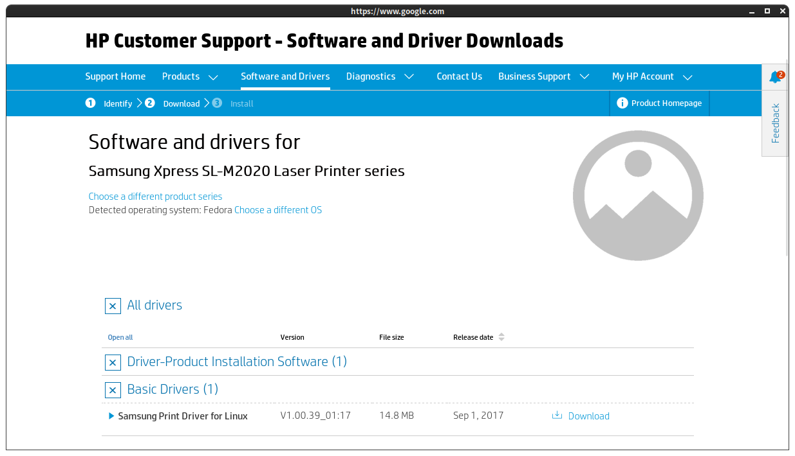
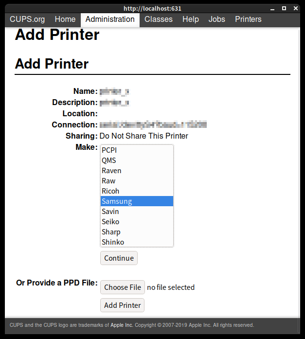

# Samsung Xpress SL-M2020 Laser Printer series

USB Vendor/Product IDs is `04e8:3321`:

```
$ lsusb
...
Bus 001 Device 004: ID 04e8:3321 Samsung Electronics Co., Ltd
...
```

The official place to download the latest driver is https://support.hp.com/us-en/drivers (the whole division was sold to HP...), search
for "Samsung Xpress SL-M2020 Laser Printer series":



The actual URL is:

```
https://ftp.hp.com/pub/softlib/software13/printers/SS/SL-C4010ND/uld_V1.00.39_01.17.tar.gz
```

Unpack the `tar.gz` file, then:

```
$ cd uld/
$ sudo ./install.sh
```

Now go to http://localhost:631, navigate to "Administration", "Add Printer". You see this dialog:



*Important*: Do not choose anything under "Make: Samsung"! None of them works. Instead, click, "Choose File" next to "Or Provide a PPD File:",
and pick up `uld/noarch/share/ppd/Samsung_M2020_Series.ppd` from where you unpacked the earlier downloaded `tar.gz`. Continue with "Add Printer". That's it.

